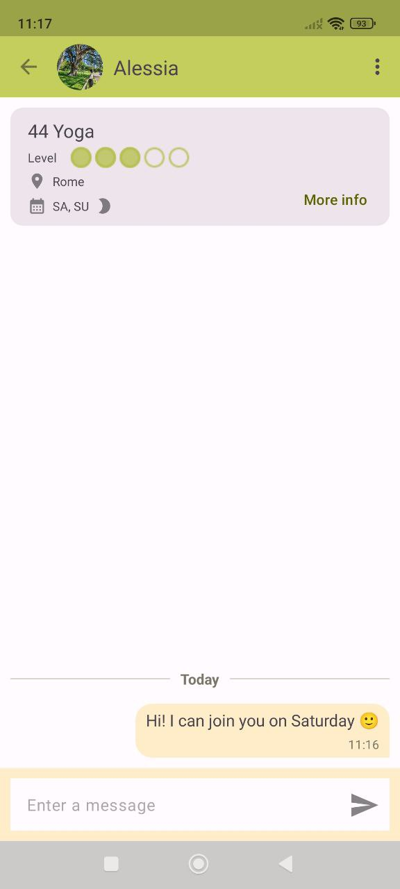

# Sport Buddy App
I have created the app which helps you easily find friends for doing sports.

### Main features
* Account (multi-step registration, login, change password, logout)
* Profile (adding photo, info, sport types with proficiency)
* Announcements (draft, publication, multiple settings)
* Search of relevant announcements (multiple parameters, including location search and keywords)
* Chats & messages
* User reactions (favourites, feedbacks)
* Statistics of announcements
* Locales - en, ru
* Support page

 

